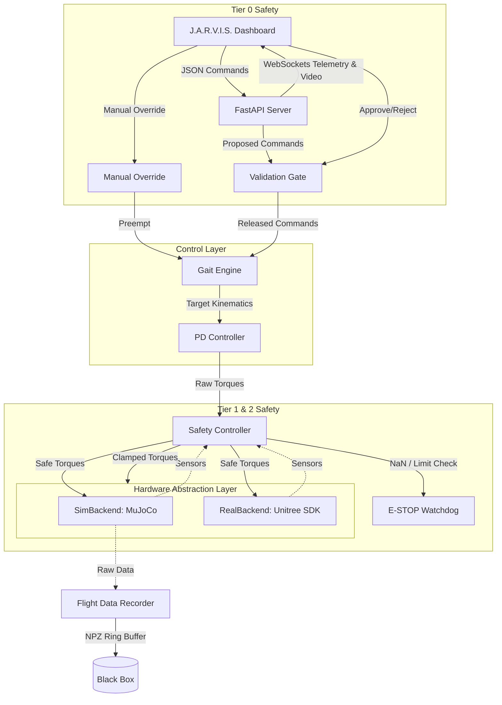

# Project PARTH: Humanoid Sim-to-Real Platform

Project PARTH is a professional-grade, deterministically engineered software stack designed to control a 19-DOF bipedal humanoid robot (based on the Unitree H1 skeleton). 

It abandons heavy middleware like ROS 2 in favor of a **Pure Python Hardware Abstraction Layer (HAL)** built around **MuJoCo**. This guarantees that the exact same control logic running the simulation will run seamlessly on the physical hardware with zero modifications.

## Core Design Principles

1. **Deterministic Loop**: The engine runs at a strict 200 Hz.
2. **Zero Dynamic Memory Allocation**: Pre-allocated NumPy arrays are used exclusively within the `step_loop` to avoid Python Garbage Collection spikes and guarantee real-time latency.
3. **Hardware Agnostic**: AI commands, kinematics, and safety logic do not know if they are interacting with the physical SDK or the MuJoCo engine.
4. **4-Tier Safety Subsystem**: Hardware limits are hardcoded. AI commands are strictly subjected to human validation.

---

## 🏗️ Architecture



---

## 🚀 Quick Start

### 1. Requirements
Ensure you have the Python dependencies installed:
```bash
pip3 install mujoco numpy fastapi uvicorn pydantic websockets opencv-python
```

### 2. Booting the Engine
Run the master start script to spin up the physics engine, the API, and the Web UI simultaneously:
```bash
cd parth_sim
./run.sh
```

### 3. Accessing the Dashboard
Open your browser and navigate to:
```
http://localhost:8000/
```
From here you can view the live telemetry, see the optical array, manually steer the robot using `WASD`, or approve incoming programmatic AI commands.

---

## ⚙️ Configuration

Configuration is managed in `config.py`.

- `BACKEND = "sim"`: Loads the DeepMind MuJoCo physics engine (`models/parth_humanoid/scene.xml`).
- `BACKEND = "real"`: Loads the Unitree Hardware SDK over ethernet. (Fails safely if unplugged).
- `CONTROL_RATE_HZ = 200`: The global engine tick speed.

---

## 🔒 The Black Box Recorder

The `recorder/blackbox.py` module continuously captures the last 60 seconds of flight data in a fast, pre-allocated memory ring buffer. 
If an E-STOP occurs (due to NaN inputs, hardware failure, or manual dashboard trigger), the engine will immediately halt and dump a `crash_report.npz` to `data/recordings/` for post-mortem forensic analysis.
